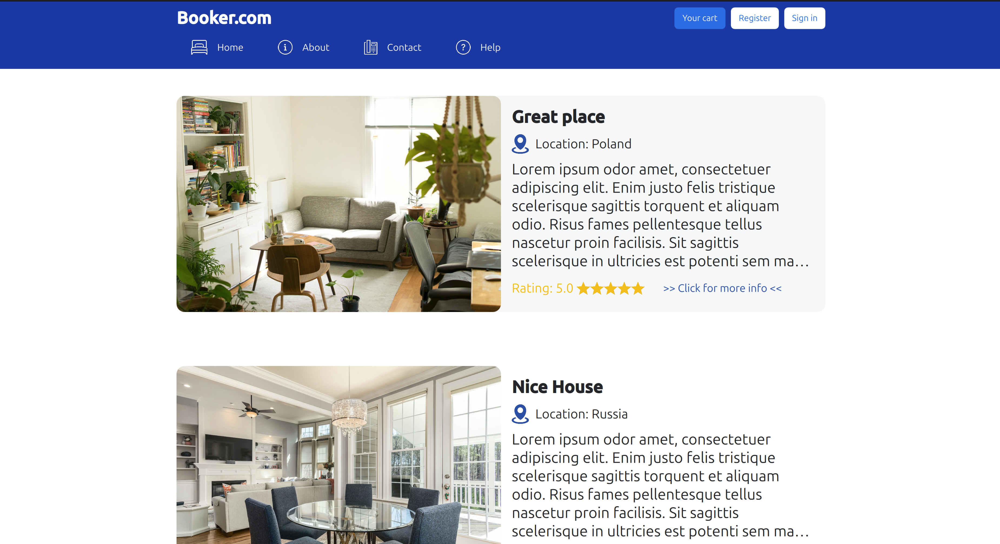
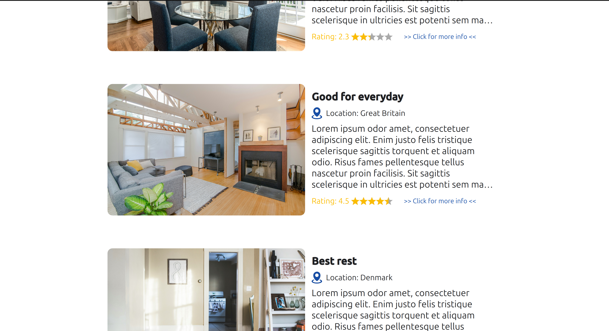
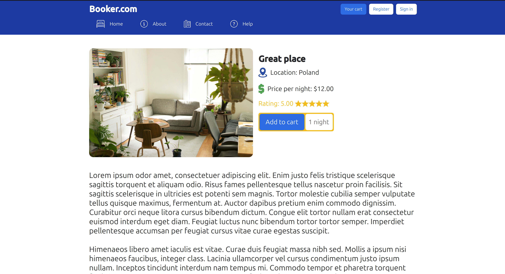
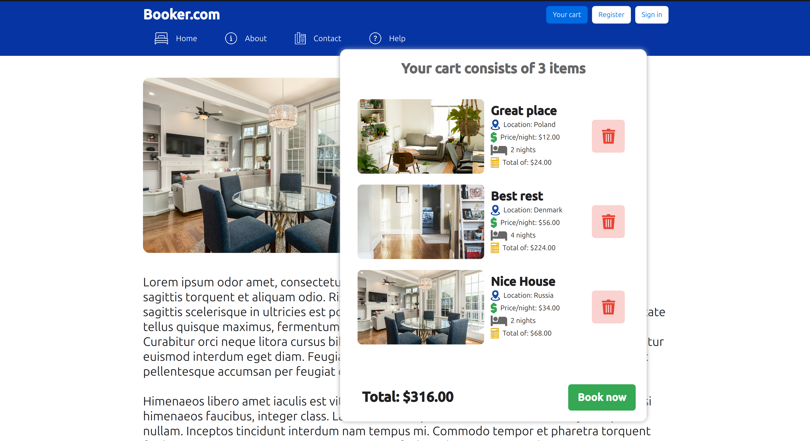

# Booker - rental

Inspired by Booking.com.

Made with Qt. Using QML and C++, compiles on Desktop and WebAssembly.

This rental has few categories:
- Categories
- Locations
- Elements

There is a functional cart system, you can add multiple elements to your cart without any problems.

There are multiple pages you can navigate.

### *Elements are just placeholders, they do not mean anything. Titles and headers may also not fit to theirs elements, they are placeholders!*

